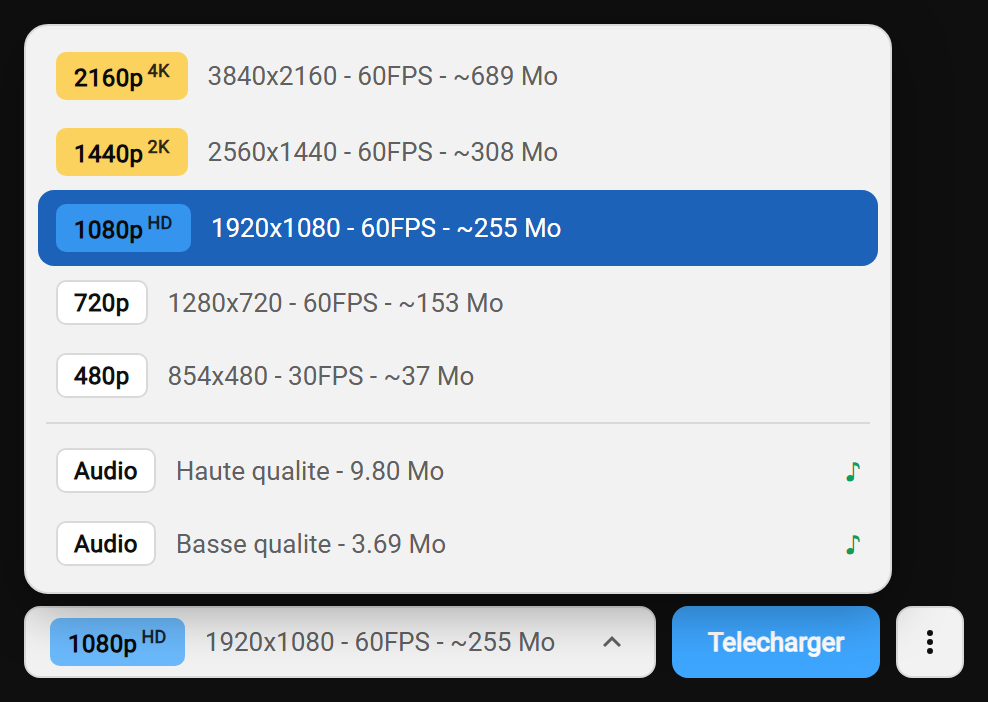
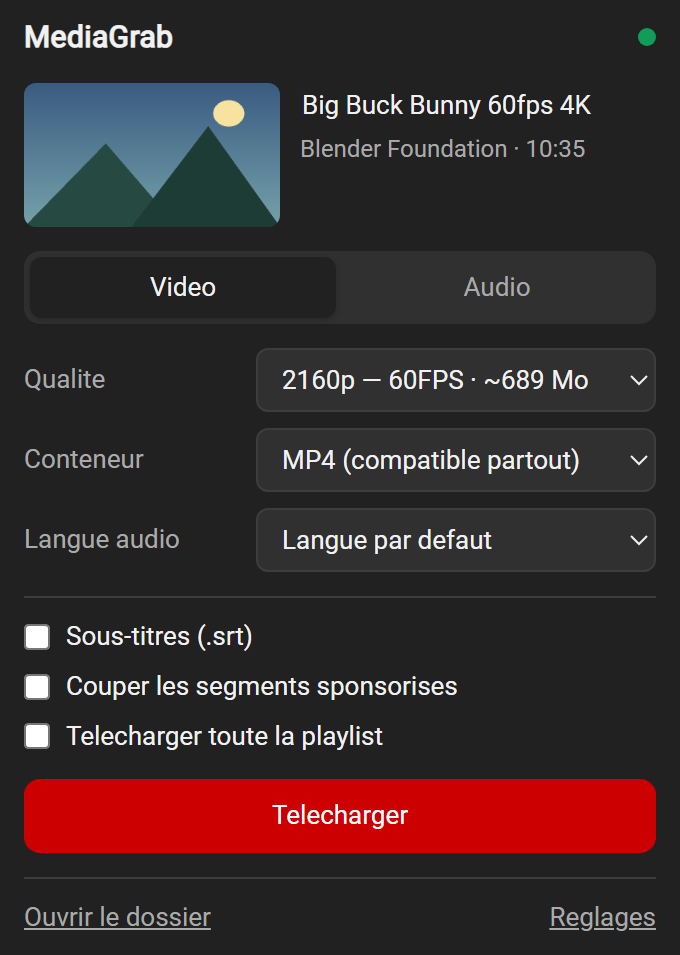
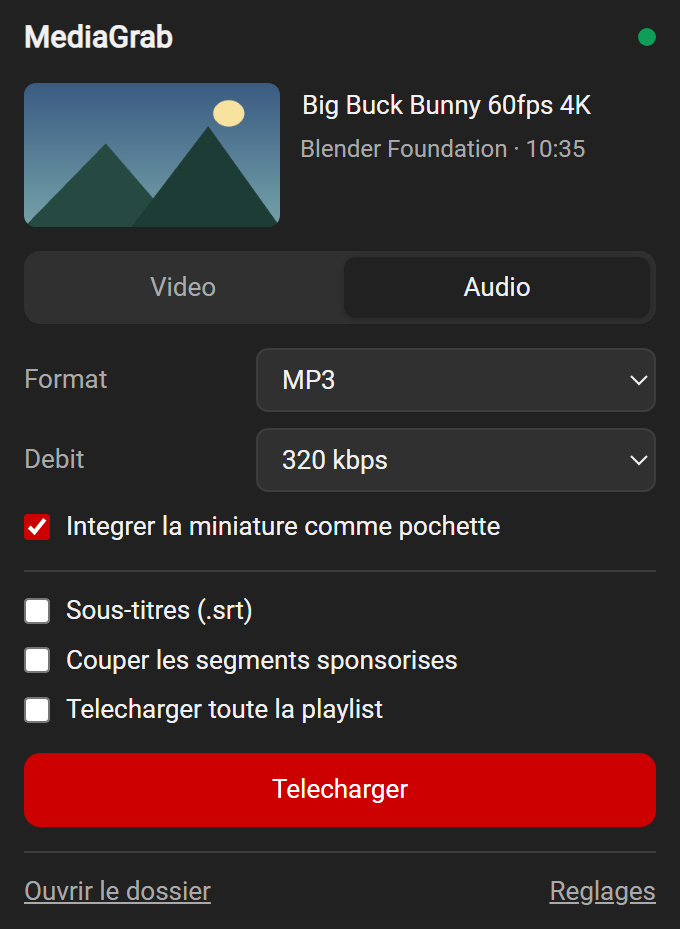
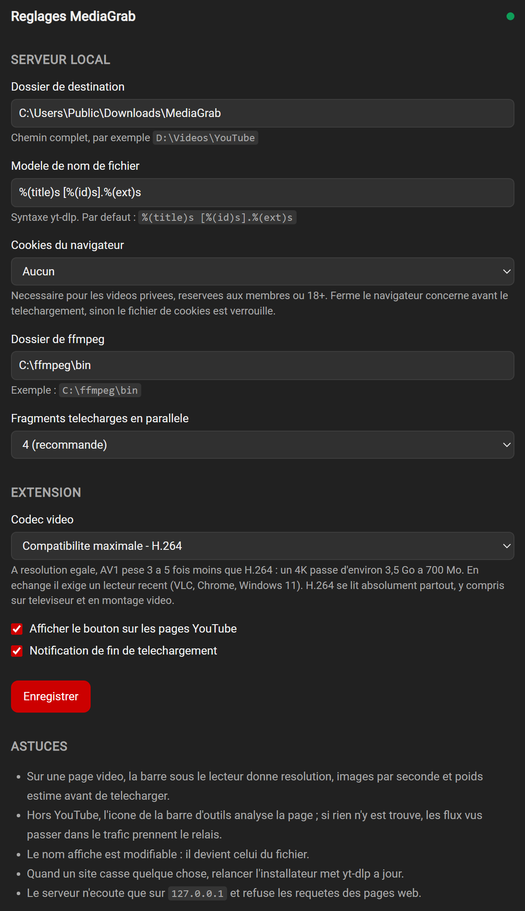

<div align="center">


# MediaGrab

**Téléchargez vidéos et musiques depuis plus de 1700 sites — en local, sans compte ni quota.**

### Site officiel : **[www.techfixbuild.fr](https://www.techfixbuild.fr/)**

[Fonctionnalités](#fonctionnalités) • [Captures](#captures) • [Installation](#installation) • [Utilisation](#utilisation) • [Comment ça marche](#comment-ça-marche) • [FAQ](#faq) • [Dépannage](#dépannage)

</div>

---

## Fonctionnalités

- **Vidéo jusqu'en 4K** — la barre sous le lecteur annonce résolution, images par seconde et poids estimé avant que vous ne choisissiez
- **Extraction audio** — MP3, M4A, Opus, FLAC ou WAV, jusqu'à 320 kbps, miniature intégrée en pochette
- **Plus de 1700 sites** — YouTube, Vimeo, Dailymotion, X, TikTok, Twitch, Arte, france.tv, SoundCloud, Reddit… et un extracteur générique pour le reste
- **Détection des flux** — les vidéos chargées en JavaScript, invisibles dans le HTML, sont repérées dans le trafic réseau (HLS, DASH, fichiers directs)
- **Shorts** — un bouton dédié dans la colonne d'actions
- **Fichiers légers (AV1)** — un interrupteur qui divise le poids par trois à cinq à résolution égale
- **Sous-titres, SponsorBlock, playlists** — en une case à cocher
- **Aucun compte, aucun quota, aucune limite journalière** — et rien qui sorte de votre machine

---

## Captures

<div align="center">

### Le sélecteur de format, directement dans la page



<sub>Chaque qualité avec sa résolution, ses images par seconde et son poids estimé. Les pistes audio sont séparées par un trait.</sub>

<br><br>

### Formats vidéo &nbsp;&nbsp;·&nbsp;&nbsp; Extraction MP3


&nbsp;&nbsp;&nbsp;


<br><br>

### Réglages



</div>

---

## Installation

### 1. Le programme

Téléchargez **`mediagrab.exe`** depuis la page des *Releases*, lancez-le, cliquez sur **Installer**.

Il télécharge ffmpeg, extrait l'extension, active le démarrage automatique et lance le serveur. Aucun prérequis : ni Python, ni ligne de commande.

> **SmartScreen** — l'exécutable n'est pas signé, un certificat coûtant plusieurs centaines d'euros par an. Windows affichera un avertissement : *Informations complémentaires* → *Exécuter quand même*. Le code source est intégralement ici, et `public\build.bat` permet de reconstruire l'exécutable soi-même.

### 2. L'extension, une seule fois

1. Cliquez sur **Ouvrir le dossier** dans la fenêtre d'installation
2. Dans Chrome, ouvrez `chrome://extensions`
3. Activez **Mode développeur**, en haut à droite
4. **Glissez le dossier `extension`** dans la page

<details>
<summary><strong>Pourquoi l'extension ne s'installe pas toute seule</strong></summary>

<br>

Le Chrome Web Store **interdit** les extensions de téléchargement de contenu en streaming, et depuis Chrome 75 un `.crx` provenant d'ailleurs est bloqué net.

Restent trois voies : le mode développeur (trois clics, aucune contrepartie), une stratégie de registre (qui affiche un bandeau « Géré par votre organisation » et exige un certificat pour ne pas déclencher les antivirus), ou rien. Le mode développeur est le meilleur compromis.

</details>

---

## Utilisation

**Sur une page vidéo** — une barre apparaît sous le lecteur. Choisissez la qualité, cliquez sur *Télécharger*. La progression s'affiche dans le bouton.

**Sur un Short** — un bouton rond s'ajoute en tête de la colonne d'actions.

**Partout ailleurs** — cliquez sur l'icône dans la barre d'outils. La page est analysée ; si elle ne révèle rien, les flux repérés dans le trafic prennent le relais.

Le nom affiché est **modifiable** : cliquez dessus, corrigez-le, il devient le nom du fichier.

Le menu **⋮** donne accès au dossier de destination, aux réglages, et à l'interrupteur *Fichiers légers*.

### AV1 : trois à cinq fois plus léger

À résolution égale, un même contenu existe en plusieurs encodages :

| | H.264 | AV1 |
|---|---|---|
| 1080p | 255 Mo | **128 Mo** |
| 720p | 153 Mo | **78 Mo** |
| 2160p | *inexistant* | **689 Mo** |

<sub>Mesuré sur une vidéo de 10 min 35.</sub>

H.264 est privilégié par défaut : il se lit absolument partout, y compris sur téléviseur et en montage vidéo. AV1 exige un lecteur récent — VLC, Chrome, Windows 11 — mais divise le poids par trois à cinq. Au-delà de 1080p, YouTube ne publie de toute façon pas de H.264 : le 4K et le 1440p arrivent en AV1.

---

## Comment ça marche

```
Page web ──► content script ──► service worker ──► 127.0.0.1:8787 ──► yt-dlp ──► ffmpeg
```

Un petit serveur tourne sur votre machine et fait le travail. L'extension n'est qu'une interface.

**Pourquoi pas tout dans le navigateur.** Les sites servent la vidéo et l'audio en flux séparés, protégés par des signatures recalculées toutes les deux à trois semaines. Un extracteur maison casse à ce rythme, ce qui oblige les extensions concurrentes à héberger un serveur — donc à le facturer. yt-dlp est corrigé en continu et tourne chez vous.

Effet de bord appréciable : ffmpeg natif fusionne un 1080p de dix minutes en 2 à 5 secondes, contre 1 à 3 minutes pour un ffmpeg compilé en WebAssembly.

### Vie privée et sécurité

- Le serveur écoute sur `127.0.0.1` **uniquement** — inaccessible depuis le réseau
- Il rejette toute requête dont l'en-tête `Origin` n'est pas celui d'une extension : une page web ne peut pas piloter vos téléchargements
- Aucune télémétrie, aucun compte, aucune connexion sortante en dehors du site que vous téléchargez

L'extension demande l'accès à tous les sites, indispensable pour observer le trafic et y repérer les flux. Cette observation est **passive** : rien n'est bloqué ni modifié, et seules les adresses sont examinées, jamais le contenu.

---

## FAQ

<details>
<summary><strong>Faut-il laisser une fenêtre ouverte ?</strong></summary>

<br>

Non. Le serveur démarre sans fenêtre à l'ouverture de session. Il occupe environ 74 Mo de mémoire et 0 % de processeur au repos.

Pour désactiver le démarrage automatique, supprimez le raccourci dans le dossier *Démarrage* de Windows.

</details>

<details>
<summary><strong>Les tailles annoncées sont-elles exactes ?</strong></summary>

<br>

Les tailles audio le sont. Les tailles vidéo sont des **estimations**, signalées par un `~` : les sites ne renseignent pas le poids des flux séparés, il est calculé à partir du débit moyen et de la durée.

Le format retenu est déterminé en interrogeant le sélecteur de yt-dlp lui-même, avec les options exactes du téléchargement — ce qui est annoncé correspond donc bien à ce qui sera obtenu.

</details>

<details>
<summary><strong>Peut-on télécharger une vidéo privée ou réservée aux membres ?</strong></summary>

<br>

Oui, en indiquant votre navigateur dans le réglage *Cookies du navigateur*. **Fermez-le avant de télécharger**, sinon son fichier de cookies est verrouillé. Astuce : réglez sur Firefox et utilisez Chrome au quotidien.

</details>

<details>
<summary><strong>Le fichier n'est pas au format demandé</strong></summary>

<br>

Quand la source est déjà dans un format lisible, aucun réencodage n'est effectué — vous pouvez donc obtenir un `.ogv` ou un `.webm` là où vous aviez demandé du MP4. C'est volontaire : forcer la conversion coûterait plusieurs minutes de calcul et une perte de qualité, sans bénéfice réel.

</details>

<details>
<summary><strong>Et Firefox, Edge ?</strong></summary>

<br>

Le serveur accepte déjà les deux. Seul l'empaquetage de l'extension reste à faire — les contributions sont bienvenues.

</details>

---

## Dépannage

| Symptôme | Solution |
|---|---|
| Pastille rouge, « serveur injoignable » | Relancer `mediagrab.exe` |
| Le serveur ne démarre pas, sans message | Lire `%LOCALAPPDATA%\MediaGrab\error.log` |
| `Sign in to confirm your age` | Activer les cookies du navigateur dans les réglages |
| Une vidéo qui marchait ne marche plus | Relancer `mediagrab.exe` : il met yt-dlp à jour |
| Aucun flux détecté | Lancer la lecture d'abord, puis rouvrir le menu |
| Le bouton n'apparaît pas | Recharger la page avec **Ctrl+F5** |
| Port 8787 occupé | Une autre instance tourne déjà ; le journal d'erreurs le confirme |

Journal du service worker : `chrome://extensions` → MediaGrab → *Inspecter les vues*.

---

## Portée légale

Outil personnel. Télécharger depuis ces sites contrevient le plus souvent à leurs conditions d'utilisation ; selon le pays, la copie privée d'une œuvre à laquelle on accède légalement relève d'une exception au droit d'auteur.

Restez sur vos propres contenus, les œuvres sous licence libre, et l'usage strictement privé — et ne rediffusez pas ce que vous récupérez.

## Licence

MIT — voir [LICENSE](LICENSE).

yt-dlp (Unlicense) et ffmpeg (LGPL/GPL) sont téléchargés à l'installation, pas redistribués ici, et restent soumis à leurs licences respectives.
